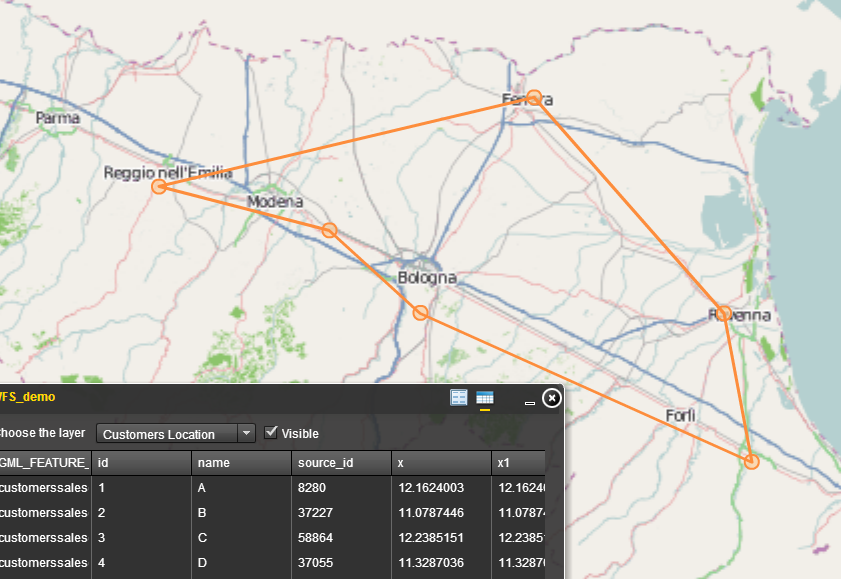
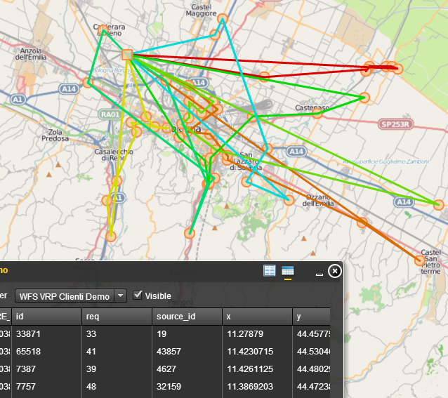

## Flexviewer WFS-T extension with Widget##

**Flexviewer WFS-T Extension** allow the use of *WFS* protocol in *Flexvier 3.x* and include a **Widget** for data consulting.

This repository is a `"fork"` of the project:
[https://code.google.com/p/wfst-arcgis-viewer/](https://code.google.com/p/wfst-arcgis-viewer/ "https://code.google.com/p/wfst-arcgis-viewer/")

### Installation ###

----------
**1.** Download the source and copy in the root of the flexviewer.

**2.** In the *Flash Builder* (`Properties->Flex Modules->Add...`) include the *Widget*.

**3.** include the Widget in the `config.xml`:

    <widget label="WFS_demo" left="360" top="300" icon=""
			config="widgets/WFS_demo/WFS_demo.xml"
			url="widgets/WFS_demo/WFS_demo.swf" />   

**4.** Configure the widget config (`see the WFS_demo.xml as example`).

**5.** Compile & Run.
  

----------

#ScreenShot  #

-------------

